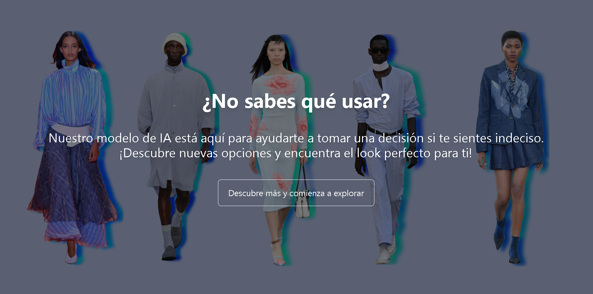
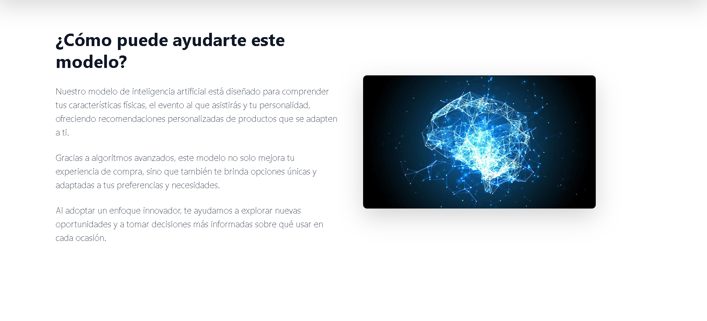
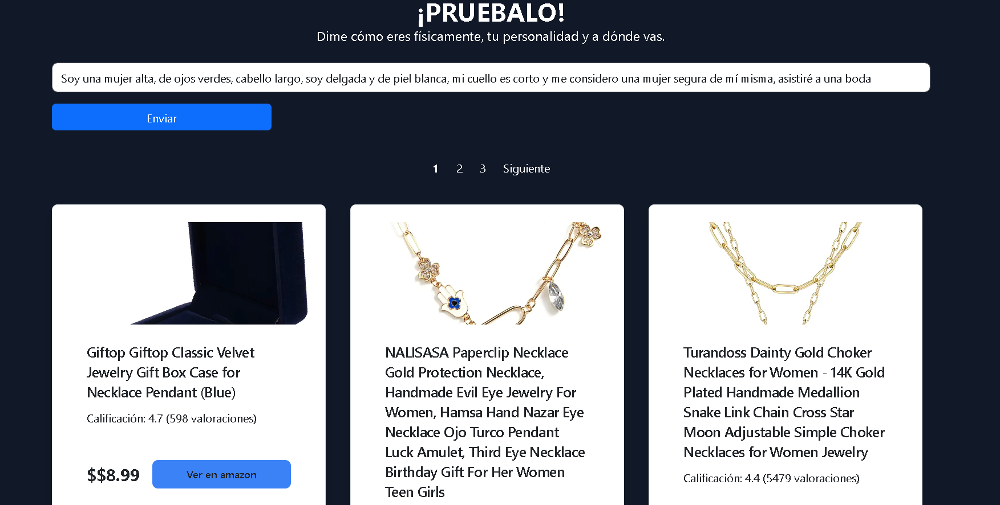
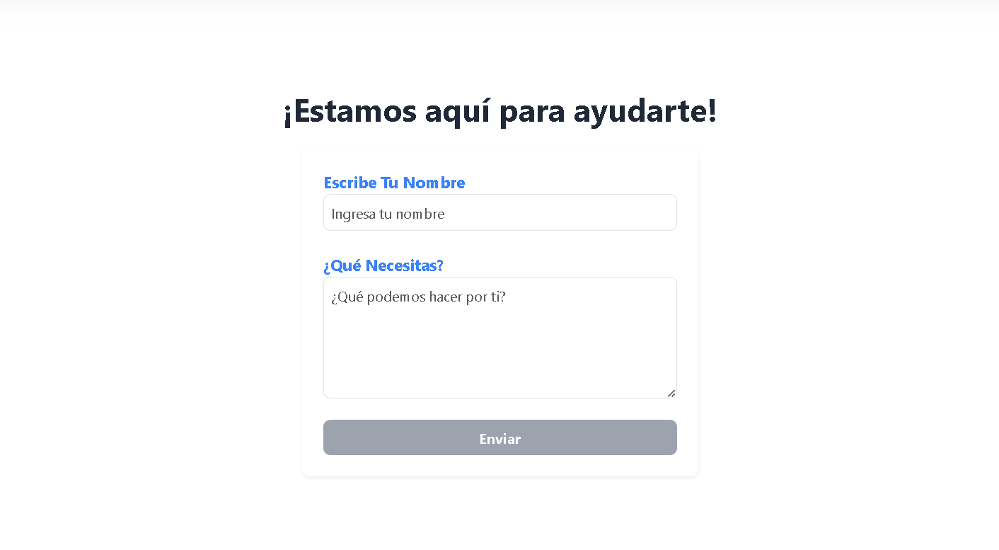

# IA de Recomendación de Productos

  

¡Bienvenido a nuestra IA de Recomendación de Productos! Esta aplicación utiliza inteligencia artificial para sugerir productos personalizados basados en las características físicas, personalidad y el evento al que asistirás.

## Home

Aquí es donde se le da la bienvenida al usuario. Nuestra IA está diseñada para ayudarte a encontrar el producto perfecto que se adapte a ti y a tus necesidades.

## About

Esta sección describe lo que hace el modelo y cómo puede ayudar al usuario. La IA analiza tus características físicas y personales, así como el tipo de evento, para recomendarte productos que realmente te gusten. Ya sea que necesites un regalo, un atuendo para una ocasión especial o accesorios únicos, nuestra IA tiene algo para ti.

## Model

En esta sección, los usuarios pueden probar el modelo. Introduce tus características físicas, personalidad y el evento al que asistirás para recibir recomendaciones personalizadas de productos.

## Contact

Si tienes preguntas o comentarios, ¡nos encantaría saber de ti! Puedes enviarnos un correo a través del formulario en esta sección. Completa el formulario a continuación y nos pondremos en contacto contigo lo antes posible.

## ¡Quiero tu opinión!
Tu experiencia es muy importante para nosotros. Nos encantaría que compartieras tus ideas, sugerencias o cualquier comentario que tengas sobre nuestra IA de Recomendación de Productos. Tu feedback nos ayudará a mejorar y a ofrecerte una experiencia aún más personalizada y útil.

Si tienes alguna mejora en mente o simplemente quieres contarnos cómo te ha ido, ¡no dudes en ponerte en contacto!

Juntos, podemos hacer que esta IA sea aún más efectiva y emocionante. ¡Gracias por ser parte de este proyecto!
